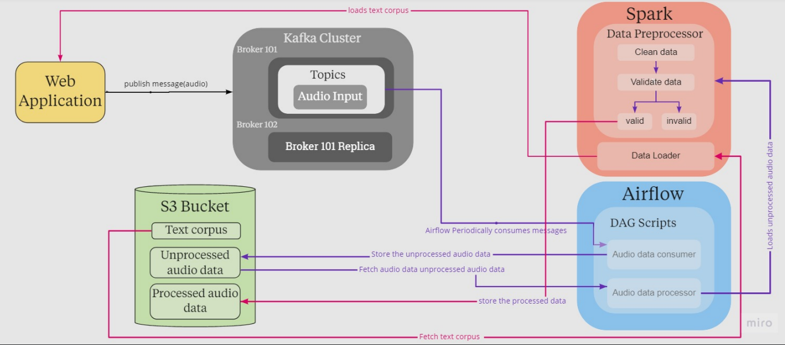

# Speech-to-text-data-collection

Speech recognition technology allows for hands-free control of smartphones, speakers, and even vehicles in a wide variety of languages. Companies have moved towards the goal of
enabling machines to understand and respond to more and more of our verbalized commands. There are many matured speech recognition systems available, such as Google Assistant,
Amazon Alexa, and Apple’s Siri. However, all of those voice assistants work for limited languages only. The purpose of this week’s challenge is to build a data engineering
pipeline that allows recording millions of Amharic and Swahili speakers reading digital texts in-app and web platforms. By the end of this project, we should produce a tool that
can be deployed to process posting and receiving text and audio files from and into a data lake, apply transformation in a distributed manner, and load it into a warehouse in a
suitable format to train a speech-t0-text model

## Technologies used 
- ``Apache Kafka``: To sequentially log streaming data into specific topics
- ``Apache Airflow``: used  to create, orchestrate and monitor data workflows. In other words, he will be used to create and update the model, whilst also scheduling such tasks.
- ``S3 Buckets``: For storing transformed streaming data
- ``Appache Spark`` : It will be used for data preprocessing,to validate the data   and finally transform the data into corpus text.

## DAG

=======
# speech-to-text-data-collection

## Introduction

 In today’s data-driven world of cut-throat competition, creating, executing and monitoring different tasks and large volumes of data is no small feat. Most companies, hence need an automated solution, that will help them manage their daily tasks. 

The Apache Kafka and Airflow are open-source task management platforms that help companies create seamlessly functioning workflows to organise, execute and monitor their tasks. Although these platforms seem to perform related tasks, some crucial differences between the two set up them apart. Spark Streaming API enables scalable, high-throughput, fault-tolerant stream processing of live data streams. Data can be ingested from many sources like Kafka. 

Our responsibility was to build a tool that can be deployed to process posting and receiving text and audio files from and into a data lake, apply transformation in a distributed manner, and load it into a warehouse in a suitable format to train a speech-t0-text model..

 
<h1> Key Topics</h1>
   Loading ....
   
<h1>Learning Objectives</h1>

<b>Skills:</b>
* Create and maintain an Apache Kafka cluster
* Work with Apache Airflow  and Apache Spark
* Apply Structured Streaming to process streaming data.
* Building data pipelines and orchestration workflows

<b>Knowledge:</b>
Enterprise-grade data engineering - using Apache and Databricks tools

<h1>Helpful Links</h1>
Loading.... 

# Contributors

* [Amon Kimutai](https://github.com/AmonKi)
* [Bereket Kibru](https://github.com/bereketkibru)
* [christian ZANOU](https://github.com/Zchristian955)
* [Desmond Onam](https://github.com/Desmondonam)
* [Eyerusalem](https://github.com/eyerus21)
* [Khairat Ayinde](https://github.com/khaiyra)
* [Natneal Teshome](https://github.com/Natty-star)
* [Zelalem Getahun](https://github.com/zelalemgetahun9374)

  
